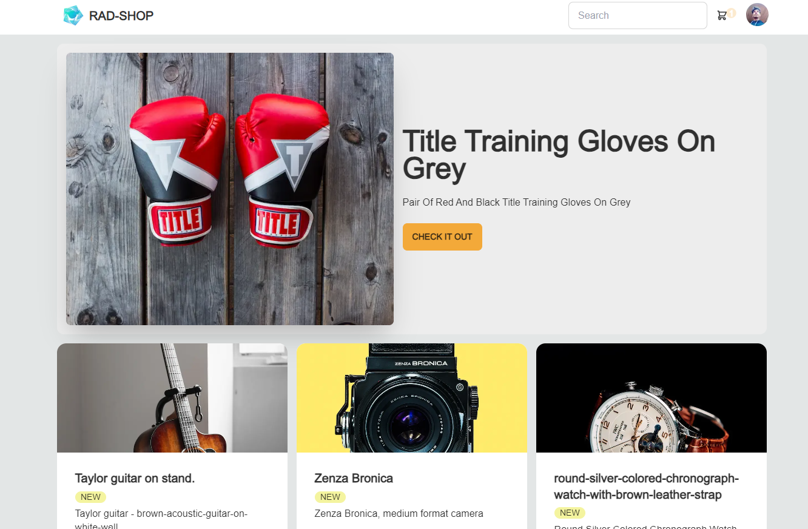

## Getting Started

```bash
npm run dev
# or
yarn dev
# or
pnpm dev
# or
bun dev
```

## packages

#### install : daisyui prisma @prisma/client next-auth @auth/prisma-adapter prettier eslint-config-prettier prettier-plugin-tailwindcss zod

#### add daisyui in config tailwind

#### inside setting vs code => Associations add: \*.css & value :tailwindcss && Quick Suggestions => strings is ON ok

##### add config daisyUi on https://daisyui.com/theme-generator
##### customize prettier.config file and eslintrc.json 

##### new project in website MongoDB
#### init prisma => npx prisma init

##### connect MongoDb  =>DATABASE_URL="mongodb+srv://Radshodam:<passwordAccessUser>@cluster0.jyclo87.mongodb.net<NameDatabaseCustom>retryWrites=true&w=majority"

##### update gitignore add .env

##### update schema prisma by MongoDB

#### pull data on database MongoDb => npx prisma db pull

#### update model schema and push => npx prisma db push

#### run npx prisma generate

#### add prisma.ts config for next js. and connect Prisma and MongoDB in the next js.

#### add product page is serverSide => and use Server for create Product

##### update config host name for sending images on domains Unsplash

##### until now => cra error page =>if throw now error use server in form pass to page in errorPage and don't use error side loading in btn submit .until don't work

#### generate data product by cache react in productPage

#### add to cart in db in Prisma & npx prisma db push && npx prisma generate

